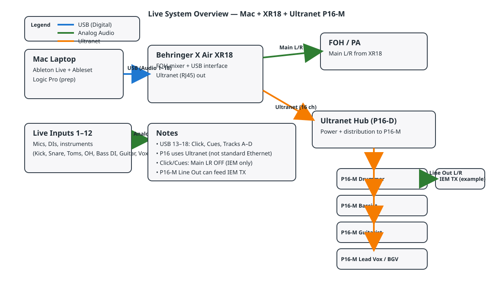

[Home](../README.md) · [Getting Started](getting-started.md) · [Architecture](architecture.md) · [X Air Routing](xair-routing.md) · [Ultranet](ultranet-routing.md) · [Tracks Prep](tracks-prep.md) · [Reaper Batch Prep](reaper-batch-prep.md) · [Operation](operation.md) · [Troubleshooting](troubleshooting.md)

# Architecture & Explanation

Summary: High‑level system flow, routing roles, and prep DAW choices so the rest of the guides make sense in context.

Plain‑language concepts
- XR18 = mixer + USB audio interface. It receives up to 18 channels from the Mac and can send 18 channels back to the Mac.
- Ableton plays stems (separate audio files per part) plus Click and Cues.
- Each stem goes to an Ableton output number (e.g., Ext. Out 15) that lands on the identically numbered XR18 channel (ch 15).
- FOH mixes stems (15–18) to the mains. Click and Cues (13–14) are for IEMs only and must never hit Main LR.
- macOS system audio typically plays on USB channels 1/2. For break music over the PA, you can temporarily map ch 17/18 to USB 1/2 (via a saved Scene) so the Mac’s apps (Spotify/Apple Music/YouTube) feed your existing stereo faders.
- IEM options:
  - Ultranet: P16‑M personal mixers get up to 16 channels from the XR18’s Ultranet port.
  - Analog IEM buses: XR18 Buses 1–5 feed Aux Outs 1–5 to your transmitters/amps.

Channel consistency principle (must do)
- For any instrument you swap from live to backing (or back), keep the same XR18 channel number. Route Ableton to that channel’s number and flip the channel Source (Analog ↔ USB). This keeps FOH workflow, IEM sends, and Ultranet slots consistent.

Prep DAW choices (overview)
- Logic Pro (recommended when songs drift): best for Smart Tempo, printed audio click/cues, and precise markers. Use this when the source is an MP3 or has tempo/meter changes.
- Ableton‑only (fast path): fine for steady‑tempo songs or when stems are already on‑grid at 48 kHz. Disable Auto‑Warp; keep timing authoritative in audio.
- Reaper + SWS (bulk prep): most efficient for large catalogs. Batch tempo mapping, markers/regions, and Render Matrix for naming/exports; then assemble in Ableton and control with Ableset.

Why 48 kHz and a 128–256 buffer?
- XR18 defaults to 48 kHz. Keep everything at 48 kHz to avoid resampling and clock issues.
- 128–256 buffer is a good live balance: low latency but stable. If you hear pops/clicks, try 256.

Terminology (assume no prior knowledge)
- Card/USB: audio coming from the computer into the XR18.
- Tap point: where a send takes signal from a channel. Pre‑EQ means FOH EQ/fader won’t change the IEM feed.
- DirOut Ch X: direct output of channel X (not a bus or the mains).

Helpful screenshots to capture
- X Air Edit → Setup → Audio/MIDI with 48 kHz selected.
- macOS Audio MIDI Setup showing the XR18 device present.

Next step: [X Air Routing](xair-routing.md)

[Home](../README.md) · [Getting Started](getting-started.md) · [Architecture](architecture.md) · [X Air Routing](xair-routing.md) · [Ultranet](ultranet-routing.md) · [Tracks Prep](tracks-prep.md) · [Reaper Batch Prep](reaper-batch-prep.md) · [Operation](operation.md) · [Troubleshooting](troubleshooting.md)
