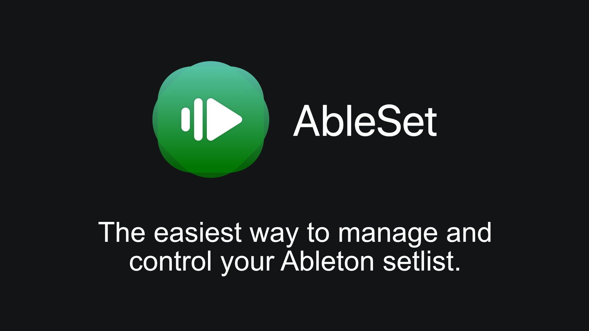

[Home](../README.md) · [Getting Started](getting-started.md) · [Architecture](architecture.md) · [X Air Routing](xair-routing.md) · [Ultranet](ultranet-routing.md) · [Tracks Prep](tracks-prep.md) · [Reaper Batch Prep](reaper-batch-prep.md) · [Operation](operation.md) · [Troubleshooting](troubleshooting.md)

# How To Prepare Tracks For Live Use

Summary: Organize files, understand when Logic/Ableton/Reaper fit, and build stems, cues, and routing so songs import cleanly into Ableton Session.

File organization and naming
- `LiveTracks/Songs/<SongName>/Stems/` — WAV stems (48 kHz / 24‑bit)
- `LiveTracks/Songs/<SongName>/MIDI/` — optional tempo/marker MIDI (reference only)
- `LiveTracks/Songs/<SongName>/Session/` — Ableton set(s) + Ableset data
- Naming examples (fast import by channel index):
  - Core: `13_Click.wav`, `14_Cues.wav`, `15_TracksA.wav`, `16_TracksB.wav`, `17_TracksC.wav`, `18_TracksD.wav`
  - Optional dedicates: `06_Bass.wav`, `07_Guitar.wav`, `12_Keys.wav`, `08_LeadVox.wav`
  - Drums multi‑stem: `01_Kick.wav`, `02_Snare.wav`, `03_Tom.wav`, `04_OH_L.wav`, `05_OH_R.wav`
  - Drums mono fallback: `04_Drums.wav`
  - Drums stereo fallback: `04_Drums_L.wav`, `05_Drums_R.wav`

Critical rule — channel numbers never change
- For any instrument: keep the same channel number whether it’s live or from tracks. Route Ableton to the live channel’s number and flip the XR18 channel Source (Analog ↔ USB).
- Examples: Bass → ch 6, Guitar → ch 7, Keys → ch 12. If running drum tracks, route Kick/Snare/Tom/OH to ch 1–5 and remove drums from stems feeding 15–18.
- Avoid duplication: when you promote an instrument to a dedicated channel, remove it from the stems so it isn’t doubled in FOH or IEMs.

## Why Logic Is In The Flow (and when to skip it)

Logic is excellent at preparing songs that didn’t start life as clean stems on a steady click.

- Smart Tempo: Quickly adapts a drifting MP3 or live recording to a reliable tempo map (downbeats, tempo/time signature changes).
- Audio click and cues: You print a click and vocal cues aligned to the bar/beat grid. Ableton then follows these audio references unwarped.
- Arrangement clarity: Global Tracks and arrangement markers make it easy to place cues at precise musical moments.
- Avoids MIDI tempo import pitfalls: Ableton does not reliably import tempo from MIDI; keeping timing authoritative in audio (click/cues) is safer live.

New to tempo maps? See Tempo Maps 101: `docs/tempo-map-from-click.md`.

Use Logic when
- The source is a stereo mix/MP3 with drift or rubato.
- You need tight musical cues or complex meter/tempo changes.
- You want repeatable exports (48 kHz/24‑bit) with tidy names per the channel plan.

Skip Logic (Ableton‑only) when
- You already have on‑grid stems at 48 kHz.
- The song is steady‑tempo and needs minimal editing.
- Fast path in Ableton: disable Auto‑Warp, create Click/Cues (use samples or a printed metronome), drop stems into a Scene, set `Audio To` outputs (13–18, and any 6/7/12 dedicates), Warp Off, balance clip Gain, save.

## Logic Work (tempo map, click, cues, export)
1) Project setup
- New project at 48 kHz, 24‑bit; set correct time signature.
- Import the song’s reference audio (full mix or a stem).

2) Generate a tempo map
- Smart Tempo: choose Adapt; play/locate so Logic adapts to the audio.
- Verify downbeats/tempo/time‑signature in Global Tracks; fix misalignments.
- Add arrangement markers (Intro/Verse/Chorus/Bridge) on bar lines.

Add a consistent count‑in (2 bars)
- Recommended convention: place the song’s first musical downbeat at bar 3. Use bars 1–2 for click pre‑roll and an optional spoken count‑in (“1‑2‑3‑4”).
- Ensure exports include bars 1–2 so every stem starts at bar 1. Click/Cues contain sound in bars 1–2; other stems are silence for those bars so everything lines up in Ableton Session.
- Alternative: advanced bar offset/negative bars with bar‑1 at the musical downbeat—still export two bars of pre‑roll into every stem so Session playback starts with a count‑in.

3) Build click and vocal cues
- Create a click track (accent bar 1). You can print it as audio.
- Import or record vocal cues (e.g., “2‑3‑4 Chorus”) aligned to the grid.

4) Export stems
- File → Export → All Tracks as Audio Files
  - WAV, 24‑bit, 48 kHz, Normalize Off.
- Optional: File → Export → Tempo/Signature (MIDI) as reference. Ableton often ignores MIDI tempo—use audio click/cues for timing in Live.
- Save into the `Stems/` folder; keep peaks around −6 dBFS for headroom.

Gain staging recipe (stems)
- Avoid heavy limiting on stems; leave headroom so FOH has room to mix.
- Target per‑stem peaks around −6 dBFS. If needed, trim/render stems so they’re not clipping.
- In Ableton, use clip Gain to balance stems so XR18 channel meters sit near 0 dB with faders near unity (−5 to 0 dB). This makes scenes consistent show to show.

Screenshots that help here
- Smart Tempo/Beat Mapping showing downbeats aligned.

  

  Note: TODO — replace with your own screenshot (Global Tracks visible with downbeats aligned).
  Source: https://support.apple.com/guide/logicpro/smart-tempo-overview-lgcpbbef4bfc/mac

- Export dialog with 48 kHz / 24‑bit / Normalize Off.

  

  Note: TODO — replace with your own screenshot of the Export dialog.
  Tip: https://support.apple.com/guide/logicpro/export-projects-lgcp2ea17c68/mac

## Ableton Work (routing, scenes, warp)
1) Audio preferences
- Preferences → Audio: Audio Device `X‑AIR XR18 (CoreAudio)`, 48 kHz, Buffer 128–256.
- Output Config: enable Mono 1–18.
- Record/Warp/Launch: disable “Auto‑Warp Long Samples”.

2) Create tracks and route outputs
- Create audio tracks: `Click`, `Cues`, `Tracks 1`, `Tracks 2`, `Tracks 3`, `Tracks 4`.
- Set `Audio To`:
  - Click → `Ext. Out 13`
  - Cues → `Ext. Out 14`
  - Tracks 1 → `Ext. Out 15`
  - Tracks 2 → `Ext. Out 16`
  - Tracks 3 → `Ext. Out 17`
  - Tracks 4 → `Ext. Out 18`
- Instrument‑swappable parts: add dedicated `Bass` → `Ext. Out 6`, `Guitar` → `Ext. Out 7`, `Keys` → `Ext. Out 12` as needed. When you promote a part to a dedicated channel, remove that instrument from the stems (e.g., if using `Keys` on 12, do not include Keys inside the stem on 17).
- No live drummer (choose one):
  - Mono summed drums: add `Drums` → `Ext. Out 4`.
  - Stereo drums: add `Drums L` → `Ext. Out 4`, `Drums R` → `Ext. Out 5`.
  - Multi‑stem drums: add `Kick` → 1, `Snare` → 2, `Tom` → 3, `OH L` → 4, `OH R` → 5.

MIDI Out (optional)
- Add a MIDI track named `MIDI Out`.
- Preferences → Link/MIDI: enable `Track` and `Remote` for `IAC Driver (Bus 1)` Output (macOS), or select your external MIDI interface.
- Set `MIDI To` → `IAC Driver (Bus 1)` (Channel 1, or as needed).
- Per song, drag `<SongName>.mid` into the `MIDI Out` clip slot in the same Scene row as the audio.
- Keep Global Quantization at 1 Bar so the MIDI clip launches in sync with the Scene.

3) Import stems per song
- Drag each song’s stems into a new Scene (one row per song).
- For every clip: turn Warp Off, set clip Gain for balance, color code.
- Keep click/cues as audio clips; don’t rely on Live’s metronome for tempo‑changing songs.

4) Organize for Ableset
- Name scenes with order numbers: `01 Run Away`, `02 Skyline`.
- Optionally group tracks and stop empty clip slots.
- Save the set in `Session/` or maintain one master set covering many songs.

Screenshots that help here
- Output Config window with Mono 1–18 enabled.

  

  Note: TODO — replace with your own screenshot captured on your system (Preferences → Audio → Output Config).
  Source: https://help.ableton.com/hc/en-us/articles/209068929-Audio-Preferences

- Track I/O section showing `Audio To: Ext. Out 13–18`.

  

  Note: TODO — replace with your own screenshot (toggle I/O section with the I/O button in Session View).
  Tip: https://help.ableton.com/ (search “Routing and I/O”)

- Clip View with Warp Off.

  

  Note: TODO — replace with your own screenshot showing the Warp switch disabled for a stem.
  Source: https://help.ableton.com/hc/en-us/articles/209773265-Warping-in-Live

## Ableset Work (setlist and control)
- Open Ableset and connect to Ableton; it reads Scenes as songs.
- Build a setlist, define sections, and enable transport control.
- Map a MIDI foot controller: Preferences → MIDI → add device → map Play/Stop/Next/Prev.
- Test navigating songs and stopping cleanly.

Screenshots that help here
- Ableset setlist view and MIDI mapping screen.

  

  Note: Temporary vendor image for visual context.
  TODO — add and use your own screenshots instead:
  - `../Assets/img/screenshots/ableset-setlist.png`
  - `../Assets/img/screenshots/ableset-midi-mapping.png`
  Source: https://www.ableset.app/

## Reaper For Large Catalogs (optional, faster at scale)

Why Reaper
- With SWS Extensions, Reaper excels at batch workflows: tempo mapping many songs, adding markers/regions, and mass rendering click/cues/stems in one pass via the Render Matrix.

High‑level workflow
1) Setup
- Install Reaper + SWS. Set project sample rate to 48 kHz.

2) Import songs and map tempo
- One song per project tab (or use regions in one project). Use tempo mapping tools to align downbeats and meter changes. Add region/markers for sections (Intro/Verse/Chorus/Bridge).

3) Build click and cues
- Add a dedicated Click track (accent bar 1). Add a Cues track with spoken prompts aligned to markers.

4) Batch render
- Use the Render Matrix to export per‑song assets (Click, Cues, and any stems) at 48 kHz/24‑bit with standardized names (e.g., `13_Click.wav`, `14_Cues.wav`, `15_TracksA.wav`, …).
- Render to `LiveTracks/Songs/<SongName>/Stems/`.

5) Assemble in Ableton
- In Ableton, disable Auto‑Warp, create the standard tracks and outputs, and drag in each song’s stems to a Scene. Keep click/cues as audio; do not rely on Live’s metronome for tempo‑changing songs.

Benefits
- Speed: Prepare dozens of songs with consistent naming in one batch.
- Reliability: Audio click/cues keep timing consistent regardless of DAW tempo import quirks.

Notes
- Reaper’s power comes with a learning curve. Consider this path when onboarding a large catalog; for single songs or simple sets, Logic or Ableton‑only may be faster.

Next step: [Automation (Bulk Import)](automation-bulk-import.md)

[Home](../README.md) · [Getting Started](getting-started.md) · [Architecture](architecture.md) · [X Air Routing](xair-routing.md) · [Ultranet](ultranet-routing.md) · [Tracks Prep](tracks-prep.md) · [Reaper Batch Prep](reaper-batch-prep.md) · [Operation](operation.md) · [Troubleshooting](troubleshooting.md)
